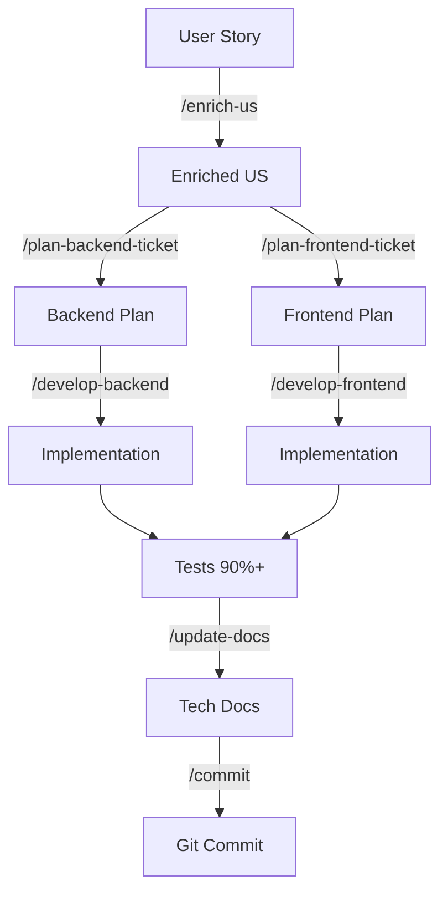

# Conceptos Clave de AI-Specs

## 🎯 Filosofía del Sistema

AI-Specs se basa en varios principios fundamentales que guían todo el desarrollo asistido por IA:

---

## 1. Single Source of Truth (SSOT)

### Concepto
**Una única fuente de verdad para todas las reglas de desarrollo.**

### Implementación
- Archivo central: `ai-specs/specs/base-standards.mdc`
- Todos los copilots referencian este archivo
- Cambios se propagan automáticamente a todos los tools

### Beneficios
- ✅ No hay contradicciones entre reglas
- ✅ Mantenimiento simplificado
- ✅ Consistencia garantizada
- ✅ Onboarding más rápido

### Ejemplo
```yaml
---
# base-standards.mdc
description: This document contains all development rules
alwaysApply: true
---

## Core Principles
- Small tasks, one at a time
- Test-Driven Development
- Type Safety
- Clear Naming
```

Todos los copilots (Claude, Cursor, Copilot, Gemini) leen estas mismas reglas.

---

## 2. Multi-Copilot Compatibility

### Concepto
**Soporte para múltiples herramientas de IA sin duplicación de código.**

### Implementación

#### Archivos de Entrada por Copilot
```
CLAUDE.md    → Optimizado para Claude/Cursor
codex.md     → Optimizado para GitHub Copilot
GEMINI.md    → Optimizado para Google Gemini
AGENTS.md    → Configuración genérica
```

#### Todos referencian la misma fuente
```markdown
<!-- En CLAUDE.md -->
See: ai-specs/specs/base-standards.mdc

<!-- En codex.md -->
See: ai-specs/specs/base-standards.mdc

<!-- En GEMINI.md -->
See: ai-specs/specs/base-standards.mdc
```

### Ventajas
- **Flexibilidad del Equipo** - Cada dev usa su copilot preferido
- **Mismo estándar** - Independiente de la herramienta
- **Zero Configuration** - Funciona out-of-the-box
- **Actualizacion centralizada** - Update once, affect all

---

## 3. Command-Based Workflow

### Concepto
**Flujo de desarrollo estructurado usando comandos predefinidos.**

### Ciclo de Vida de una Feature



### Comandos Principales

#### 1. `/enrich-us [TICKET-ID]`
**Propósito:** Enriquecer user story con detalles técnicos

**Input:** 
```
User Story básica:
"Como reclutador, quiero actualizar una posición para mantener la info actualizada"
```

**Output:**
- Detailed acceptance criteria
- Edge cases y validaciones
- Technical considerations
- Testing scenarios
- Non-functional requirements
- Definition of Done

**Cuándo usar:** Cuando la US es muy simple o falta detalle

---

#### 2. `/plan-backend-ticket [TICKET-ID]`
**Propósito:** Generar plan detallado de implementación backend

**Output:** Archivo `ai-specs/changes/[TICKET-ID]_backend.md`

**Contenido del plan:**
```markdown
# Backend Implementation Plan: [TICKET-ID]

## Overview
## Architecture Context
## Implementation Steps
  - Step 0: Create Feature Branch
  - Step 1: Create Validation Function
  - Step 2: Create Service Method
  - Step 3: Create Controller Method
  - Step 4: Add Route
  - Step 5: Write Comprehensive Tests
  - Step 6: Update Technical Documentation
## Testing Checklist
## Error Response Format
## Dependencies
## Notes
```

**Incluye:**
- Código de ejemplo completo
- Tests con >90% coverage
- Error handling
- Business rules
- Validation logic

---

#### 3. `/plan-frontend-ticket [TICKET-ID]`
**Propósito:** Generar plan detallado de implementación frontend

**Output:** Archivo `ai-specs/changes/[TICKET-ID]_frontend.md`

**Contenido similar a backend pero con:**
- React components structure
- State management
- UI/UX patterns
- Bootstrap implementation
- Cypress E2E tests
- React Testing Library unit tests

---

#### 4. `/develop-backend @[PLAN.md]`
**Propósito:** Implementar feature siguiendo el plan generado

**Proceso:**
1. Create feature branch
2. Implement validation layer
3. Implement service layer
4. Implement controller layer
5. Add routes
6. Write tests (90%+ coverage)
7. Update technical docs
8. Run tests
9. Commit (optional: wait for confirmation)

**Ejemplo:**
```bash
/develop-backend @SCRUM-10_backend.md
```

---

#### 5. `/develop-frontend @[PLAN.md]`
**Propósito:** Implementar feature frontend siguiendo el plan

**Proceso:**
1. Create feature branch
2. Create components
3. Implement state management
4. Add styling (Bootstrap)
5. Write E2E tests (Cypress)
6. Write unit tests (Jest/RTL)
7. Update docs
8. Run tests
9. Commit

---

#### 6. `/update-docs`
**Propósito:** Actualizar documentación técnica después de cambios

**Mandatory antes de commits.**

**Revisa y actualiza:**
- `api-spec.yml` - Si cambió API
- `data-model.md` - Si cambió BD o modelos
- `development_guide.md` - Si cambió setup
- `*-standards.mdc` - Si cambió proceso

---

#### 7. `/commit`
**Propósito:** Generar commit message descriptivo siguiendo convenciones

**Genera:**
```
feat(positions): add update position endpoint

- Implement PUT /positions/:id endpoint
- Add validatePositionUpdate function
- Add updatePositionService with business logic
- Add updatePosition controller with error handling
- Write comprehensive tests (90%+ coverage)
- Update API documentation

Resolves SCRUM-10
```

---

### Beneficios del Workflow por Comandos

#### ✅ Consistencia
- Mismo proceso para todas las features
- Calidad predecible
- Menos errores humanos

#### ✅ Autonomía de la IA
- Puede trabajar end-to-end
- Menos intervención manual
- Mayor velocidad de desarrollo

#### ✅ Documentación Automática
- Planes quedan guardados
- Rastro de decisiones técnicas
- Facilita code reviews

#### ✅ Escalabilidad
- Nuevos comandos se pueden agregar fácilmente
-  Comandos compuestos posibles
- Extensible a necesidades de proyecto

---

## 4. Domain-Driven Design (DDD)

### Concepto
**Arquitectura centrada en el dominio de negocio.**

### Capas de la Arquitectura

```
┌─────────────────────────────────────┐
│     Presentation Layer              │
│   (Controllers, Routes)             │
├─────────────────────────────────────┤
│     Application Layer               │
│   (Services, Validators)            │
├─────────────────────────────────────┤
│     Domain Layer                    │
│   (Models, Repository Interfaces)   │
├─────────────────────────────────────┤
│     Infrastructure Layer            │
│   (Prisma, Database, Logger)        │
└─────────────────────────────────────┘
```

### Principios Clave

#### **Entities**
Objetos con identidad única que persiste.
```typescript
export class Candidate {
    id?: number;
    firstName: string;
    lastName: string;
    email: string;
}
```

#### **Value Objects**
Objetos definidos por sus atributos, sin identidad.
```typescript
export class Education {
    institution: string;
    title: string;
    startDate: Date;
    endDate?: Date;
}
```

#### **Aggregates**
Clusters de objetos tratados como unidad.
```typescript
export class Candidate {
    id?: number;
    firstName: string;
    educations: Education[];  // Aggregate
    workExperiences: WorkExperience[];  // Aggregate
}
```

#### **Repositories**
Interfaces para acceso a datos.
```typescript
export interface ICandidateRepository {
    findById(id: number): Promise<Candidate | null>;
    save(candidate: Candidate): Promise<Candidate>;
    findAll(): Promise<Candidate[]>;
}
```

#### **Domain Services**
Lógica que no pertenece naturalmente a una entidad.
```typescript
export class CandidateService {
    static calculateAge(candidate: Candidate): number {
        // Business logic
    }
}
```

### Ventajas DDD
- **Improved Communication** - Lenguaje común con expertos
- **Clear Domain Models** - Refleja reglas de negocio
- **High Maintainability** - División clara en subdominios
- **Scalability** - Fácil evolución del sistema

---

## 5. Test-Driven Development (TDD)

### Concepto
**Escribir tests antes que el código de producción.**

### Ciclo Red-Green-Refactor

```
┌─────────────┐
│   1. RED    │  Escribir test fallido
│ (Test fails)│
└──────┬──────┘
       │
       ▼
┌─────────────┐
│  2. GREEN   │  Implementación mínima
│ (Test passes)│
└──────┬──────┘
       │
       ▼
┌─────────────┐
│ 3. REFACTOR │  Mejorar código
│ (Tests still│
│   pass)     │
└─────────────┘
```

### Implementación en AI-Specs

#### Requisitos Obligatorios
- **90%+ coverage** en todas las capas
- Tests para branches, functions, lines, statements
- AAA pattern (Arrange-Act-Assert)

#### Estructura de Tests

```typescript
describe('[Component] - [method]', () => {
    beforeEach(() => {
        jest.clearAllMocks();
    });

    describe('should_[expected_behavior]_when_[condition]', () => {
        it('should [specific test case]', async () => {
            // Arrange - Setup
            const input = { ... };
            const expected = { ... };

            // Act - Execute
            const result = await functionUnderTest(input);

            // Assert - Verify
            expect(result).toEqual(expected);
        });
    });
});
```

#### Capas de Testing

**1. Unit Tests**
```typescript
// Validation layer
describe('validatePositionUpdate', () => {
    it('should throw error when title is empty', () => {
        expect(() => validatePositionUpdate({ title: '' }))
            .toThrow('Title is required');
    });
});

// Service layer (mocked repos)
describe('updatePositionService', () => {
    it('should update position successfully', async () => {
        // Mock dependencies
        // Test business logic
    });
});

// Controller layer (mocked services)
describe('updatePosition', () => {
    it('should return 200 with updated position', async () => {
        // Mock service
        // Test HTTP handling
    });
});
```

**2. Integration Tests**
- Controller + Service + Real DB
- E2E flows completos
- Cypress para frontend

**3. Manual Tests**
- Casos borde
- UX flows
- Performance

### Beneficios TDD
- ✅ **Confidence** - Tests garantizan funcionalidad
- ✅ **Design** - Código más testable y modular
- ✅ **Documentation** - Tests documentan comportamiento esperado
- ✅ **Regression Prevention** - Detecta bugs temprano

---

## 6. SOLID Principles

### Single Responsibility Principle (SRP)
**Una clase, una responsabilidad.**

```typescript
// ✅ Good - Separated responsibilities
class Candidate {
    validateEmail(): void { ... }
}

class CandidateRepository {
    save(candidate: Candidate): Promise<Candidate> { ... }
}

// ❌ Bad - Multiple responsibilities
class Candidate {
    validateEmail(): void { ... }
    saveToDatabase(): Promise<void> { ... }  // Wrong layer!
}
```

### Open/Closed Principle (OCP)
**Abierto para extensión, cerrado para modificación.**

```typescript
// ✅ Good - Extension via inheritance
class Candidate {
    save(): Promise<Candidate> { ... }
}

class CandidateWithEmail extends Candidate {
    sendEmail(): void { ... }
}

// ❌ Bad - Modifying existing class
class Candidate {
    save(): Promise<Candidate> { ... }
    sendEmail(): void { ... }  // Adding new functionality = modification
}
```

### Liskov Substitution Principle (LSP)
**Objetos derivados deben poder reemplazar a la clase base.**

```typescript
// ✅ Good - Proper substitution
class BaseRepository {
    save(data: any): Promise<any> { ... }
}

class CandidateRepository extends BaseRepository {
    save(candidate: Candidate): Promise<Candidate> {
        // Valid implementation
    }
}
```

### Interface Segregation Principle (ISP)
**Interfaces pequeñas y específicas.**

```typescript
// ✅ Good - Segregated interfaces
interface SaveOperation {
    save(): void;
}

interface EmailOperation {
    sendEmail(): void;
}

class Candidate implements SaveOperation, EmailOperation {
    save() { ... }
    sendEmail() { ... }
}

// ❌ Bad - Fat interface
interface CandidateOperations {
    save(): void;
    validate(): void;
    sendEmail(): void;
    generateReport(): void;  // Not all clients need this
}
```

### Dependency Inversion Principle (DIP)
**Depender de abstracciones, no de implementaciones concretas.**

```typescript
// ✅ Good - Depends on abstraction
interface Database {
    save(data: any): Promise<any>;
}

class Candidate {
    constructor(private database: Database) { }
    
    async save(): Promise<Candidate> {
        return await this.database.save(this);
    }
}

// ❌ Bad - Depends on concrete implementation
class Candidate {
    private database = new PrismaClient();  // Tight coupling!
}
```

---

## 7. Incremental Development

### Concepto
**Baby steps, one task at a time.**

### Regla de Oro
> "Always work in baby steps, one at a time. Never go forward more than one step."

### Aplicación Práctica

#### ❌ Wrong Approach
```
Task: Implement update position feature
- ❌ Crear validation + service + controller + tests todo junto
- ❌ Saltar pasos
- ❌ No probar después de cada paso
```

#### ✅ Correct Approach
```
Task: Implement update position feature

Step 1: Create validation function
  → Write code
  → Test it works
  → Commit

Step 2: Create service method
  → Write code
  → Test it works
  → Commit

Step 3: Create controller method
  → Write code
  → Test it works
  → Commit

...etc
```

### Beneficios
- **Easier debugging** - Problema está en el último paso
- **Better code reviews** - Commits pequeños y enfocados
- **Less merge conflicts** - Cambios frecuentes
- **Psychological** - Progreso visible constante

---

## 8. English-Only Policy

### Concepto
**Todo artefacto técnico DEBE estar en inglés.**

### Alcance

#### ✅ Must be in English
- Code (variables, functions, classes)
- Comments
- Error messages
- Log messages
- Documentation (README, guides, API docs)
- Jira tickets (titles, descriptions, comments)
- Data schemas and database names
- Configuration files
- Scripts
- Git commit messages
- Test names and descriptions

#### 📝 Exceptions
- Documentación de estudio personal (como esta)
- Comunicación dentro del equipo en español
- Comentarios temporales durante debugging

### Razón
- **Global Collaboration** - Equipos internacionales
- **Industry Standard** - Industria usa inglés
- **AI Training** - Mejor performance de modelos de IA
- **Documentation** - Mayoría de recursos están en inglés

### Ejemplo

```typescript
// ✅ Good
export class Candidate {
    async save(): Promise<Candidate> {
        // Save candidate to database
        return await this.database.save(this);
    }
}
logger.info('Candidate created successfully', { candidateId: candidate.id });

// ❌ Bad
export class Candidato {
    async guardar(): Promise<Candidato> {
        // Guardar candidato en la base de datos
        return await this.baseDatos.guardar(this);
    }
}
logger.info('Candidato creado exitosamente', { idCandidato: candidato.id });
```

---

## 9. Type Safety

### Concepto
**Todo el código debe estar completamente tipado.**

### Implementación

#### TypeScript Strict Mode
```json
// tsconfig.json
{
    "compilerOptions": {
        "strict": true,
        "noImplicitAny": true,
        "strictNullChecks": true,
        "strictFunctionTypes": true
    }
}
```

#### Evitar `any`
```typescript
// ❌ Bad
function processData(data: any): any {
    return data;
}

// ✅ Good
interface ProcessDataInput {
    id: number;
    name: string;
}

function processData(data: ProcessDataInput): ProcessDataOutput {
    return { processedId: data.id };
}
```

#### Tipos Explícitos
```typescript
// ✅ Good - Explicit types
async function findCandidateById(id: number): Promise<Candidate | null> {
    const data = await prisma.candidate.findUnique({ where: { id } });
    return data ? new Candidate(data) : null;
}

// ❌ Avoid - Implicit return type
async function findCandidateById(id: number) {
    const data = await prisma.candidate.findUnique({ where: { id } });
    return data ? new Candidate(data) : null;
}
```

### Beneficios
- **Fewer Bugs** - Errores detectados en compile time
- **Better IDE Support** - Autocomplete, refactoring
- **Self-Documenting** - Types son documentación viva
- **Easier Refactoring** - TypeScript avisa de breaking changes

---

## 10. Separation of Concerns

### Concepto
**Cada capa tiene su responsabilidad específica.**

### Arquitectura en Capas

```typescript
// ✅ Good - Clear separation

// Presentation Layer - HTTP handling only
async function updatePosition(req: Request, res: Response) {
    const positionId = parseInt(req.params.id);
    const updatedPosition = await updatePositionService(positionId, req.body);
    res.json({ message: 'Success', data: updatedPosition });
}

// Application Layer - Business logic only
async function updatePositionService(id: number, data: any) {
    validatePositionUpdate(data);  // Validation
    const position = await Position.findOne(id);
    // Business logic...
    return await position.save();
}

// Domain Layer - Entity behavior only
class Position {
    async save(): Promise<Position> {
        return await prisma.position.update({ ... });
    }
}
```

```typescript
// ❌ Bad - Mixed concerns

async function updatePosition(req: Request, res: Response) {
    // Validation (should be in service)
    if (!req.body.title || req.body.title.length > 100) {
        return res.status(400).json({ error: 'Invalid title' });
    }
    
    // Database access (should be in domain/repository)
    const position = await prisma.position.update({
        where: { id: parseInt(req.params.id) },
        data: req.body
    });
    
    res.json(position);
}
```

### Beneficios
- **Testability** - Cada capa se puede probar independientemente
- **Maintainability** - Cambios localizados
- **Reusability** - Business logic reutilizable
- **Clarity** - Propósito claro de cada componente

---

## 🎓 Resumen de Conceptos Clave

| Concepto | Definición Breve | Beneficio Principal |
|----------|------------------|---------------------|
| **SSOT** | Una fuente de verdad para reglas | Consistencia total |
| **Multi-Copilot** | Soporte para múltiples AI tools | Flexibilidad del equipo |
| **Command-Based** | Workflow con comandos predefinidos | Desarrollo autónomo |
| **DDD** | Arquitectura centrada en dominio | Refleja negocio |
| **TDD** | Tests antes que código | Alta confianza |
| **SOLID** | Principios OOP | Código mantenible |
| **Incremental** | Pasos pequeños | Menos errores |
| **English-Only** | Todo en inglés | Colaboración global |
| **Type Safety** | TypeScript strict | Menos bugs |
| **SoC** | Separación de responsabilidades | Testabilidad |

---

**Próximo paso:** Lee [Estándares de Desarrollo](./03-estandares-desarrollo.md) para ver cómo se aplican estos conceptos en práctica.

**Última actualización:** Marzo 2025
