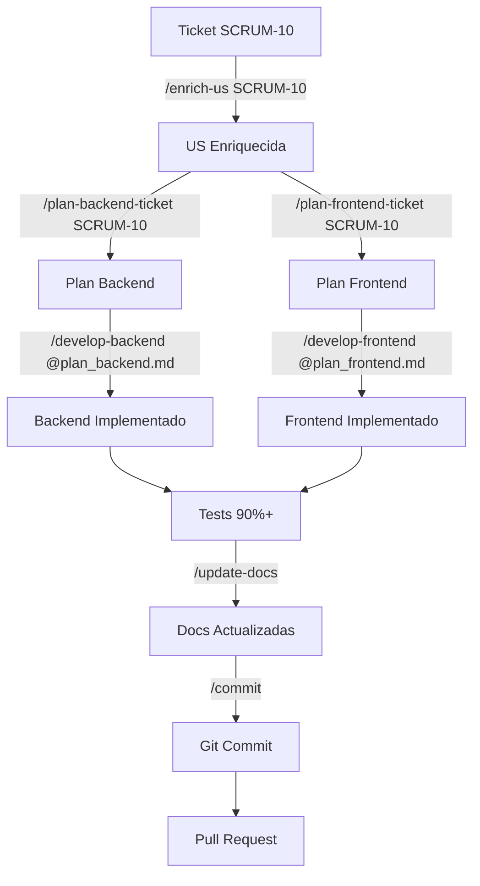

# Sistema de Comandos

## 📝 Visión General

El sistema de comandos de AI-Specs proporciona prompts predefinidos y reutilizables que automatizan tareas comunes del desarrollo.

**Ubicación:** `ai-specs/.commands/`

---

## 🎯 Comandos Disponibles

### 1. `/enrich-us [TICKET-ID]`

**Archivo:** `enrich-us.md` (~1,577 bytes)

**Propósito:** Enriquecer user stories con detalles técnicos completos

**Input:**
```
User Story básica:
"Como reclutador, quiero actualizar una posición 
para mantener la información actualizada"
```

**Output:** Genera archivo `ai-specs/changes/[TICKET-ID]-[name].md` con:
- User Story detallada
- Technical Specification
- API Endpoint Documentation
- Database Fields
- Validation Rules (server & client)
- Security Requirements
- Testing Requirements
- Acceptance Criteria
- Non-Functional Requirements
- Definition of Done

**Cuándo usar:**
- User story muy simple o poco detallada
- Falta de criterios de aceptación
- Necesitas identificar edge cases
- Quieres definir testing scenarios

**Ejemplo de ejecución:**
```
/enrich-us SCRUM-10
```

**Output esperado:**
```markdown
# SCRUM-10: Update Position Feature

## User Story
**As a** recruiter
**I want** to update existing position details
**So that** I can keep job listings current and accurate

## Technical Specification
### API Endpoint
PUT /positions/:id

### Request Body
...

## Validation Rules
### Server-Side
- Title: Required, max 100 chars
- Status: Must be one of [Open, Contratado, Cerrado, Borrador]
...

## Acceptance Criteria
- [ ] Recruiter can update all position fields
- [ ] Partial updates are supported
- [ ] Validation prevents invalid data
...
```

---

### 2. `/plan-backend-ticket [TICKET-ID]`

**Archivo:** `plan-backend-ticket.md` (~5,655 bytes)

**Propósito:** Generar plan detallado de implementación backend

**Output:** `ai-specs/changes/[TICKET-ID]_backend.md`

**Contenido del plan:**
1. **Overview** - Descripción y principios clave
2. **Architecture Context** 
   - Layers involved (Presentation, Application, Domain, Infrastructure)
   - Components referenced (files to modify)
3. **Implementation Steps** (paso a paso)
   - Step 0: Create Feature Branch
   - Step 1: Create Validation Function
   - Step 2: Create Service Method
   - Step 3: Create Controller Method
   - Step 4: Add Route
   - Step 5: Write Comprehensive Tests (ALL layers)
   - Step 6: Update Technical Documentation
4. **Implementation Order** - Secuencia exacta
5. **Testing Checklist** - Unit, manual, integration, regression
6. **Error Response Format** - HTTP status codes mapping
7. **Dependencies** - External & internal
8. **Notes** - Business rules, important reminders

**Características:**
- ✅ Código de ejemplo completo
- ✅ Tests con cobertura 90%+
- ✅ Error handling detallado
- ✅ Validation logic completa
- ✅ Mock strategies
- ✅ AAA pattern en tests

**Ejemplo de ejecución:**
```
/plan-backend-ticket SCRUM-10
```

**Genera:** `ai-specs/changes/SCRUM-10_backend.md`

**Extracto del plan generado:**
```markdown
### Step 1: Create Validation Function

**File**: `backend/src/application/validator.ts`

**Function Signature:**
```typescript
export const validatePositionUpdate = (data: any): void
```

**Implementation Steps:**
1. Add validation function after existing validators
2. Implement validation rules for all updateable fields:
   - Title: non-empty string, 1-100 chars
   - Status: must be [Open, Contratado, Cerrado, Borrador]
   - SalaryMin/Max: number >= 0, min <= max
   ...

**Example Implementation:**
```typescript
export const validatePositionUpdate = (data: any): void => {
    if (data.title !== undefined) {
        if (!data.title || typeof data.title !== 'string') {
            throw new Error('Title is required and must be a valid string');
        }
        if (data.title.length > 100) {
            throw new Error('Title cannot exceed 100 characters');
        }
    }
    // ... más validaciones
};
```
```

---

### 3. `/plan-frontend-ticket [TICKET-ID]`

**Archivo:** `plan-frontend-ticket.md` (~5,936 bytes)

**Propósito:** Generar plan detallado de implementación frontend

**Output:** `ai-specs/changes/[TICKET-ID]_frontend.md`

**Contenido similar a backend:**
- Overview
- Architecture Context (React components structure)
- Implementation Steps
  - Step 0: Create Feature Branch
  - Step 1: Create Components
  - Step 2: Implement State Management
- Step 3: Add Styling (Bootstrap)
  - Step 4: Write E2E Tests (Cypress)
  - Step 5: Write Unit Tests (Jest + RTL)
  - Step 6: Update Documentation
- Testing Checklist
- Component Structure
- Dependencies

**Ejemplo de ejecución:**
```
/plan-frontend-ticket SCRUM-15
```

---

### 4. `/develop-backend @[PLAN.md]`

**Archivo:** `develop-backend.md` (~832 bytes)

**Propósito:** Implementar feature backend siguiendo el plan generado

**Proceso automatizado:**
1. Create feature branch `feature/[TICKET-ID]-backend`
2. Implement validation function
3. Implement service layer
4. Implement controller layer
5. Add routes
6. Write comprehensive tests (90%+ coverage)
7. Update technical documentation
8. Run tests to verify
9. Commit changes (optional: wait for confirmation)

**Ejemplo de ejecución:**
```
/develop-backend @SCRUM-10_backend.md
```

**Qué hace la IA:**
- Lee el plan completo
- Sigue los pasos secuencialmente
- Implementa código real
- Escribe tests completos
- Actualiza documentación
- Verifica que todo funciona

**Output esperado:**
```
✅ Branch created: feature/SCRUM-10-backend
✅ Validation function implemented
✅ Service method implemented
✅ Controller method implemented
✅ Route added
✅ Tests written (coverage: 92%)
✅ API documentation updated
✅ All tests passing
✅ Ready for commit
```

---

### 5. `/develop-frontend @[PLAN.md]`

**Archivo:** `develop-frontend.md` (~2,977 bytes)

**Propósito:** Implementar feature frontend siguiendo el plan

**Proceso:**
1. Create feature branch `feature/[TICKET-ID]-frontend`
2. Create React components
3. Implement state management (hooks)
4. Add Bootstrap styling
5. Write E2E tests (Cypress)
6. Write unit tests (Jest + RTL)
7. Update documentation
8. Run tests
9. Commit

**Ejemplo de ejecución:**
```
/develop-frontend @SCRUM-15_frontend.md
```

---

### 6. `/commit`

**Archivo:** `commit.md` (~5,933 bytes)

**Propósito:** Generar commit message descriptivo siguiendo convenciones

**Analiza:**
- Archivos modificados
- Tipo de cambios (feat, fix, docs, refactor, test)
- Scope del cambio
- Descripción detallada

**Output:**
```
feat(positions): add update position endpoint

- Implement PUT /positions/:id endpoint
- Add validatePositionUpdate function with comprehensive rules
- Add updatePositionService with business logic
- Add updatePosition controller with error handling
- Write comprehensive tests (92% coverage)
  - Validation layer tests
  - Service layer tests
  - Controller layer tests
- Update API documentation (api-spec.yml)

Resolves SCRUM-10
```

**Ejemplo de ejecución:**
```
/commit
```

---

### 7. `/update-docs`

**Archivo:** `update-docs.md` (~121 bytes)

**Propósito:** Actualizar documentación técnica después de cambios

**Mandatory antes de cada commit.**

**Proceso:**
1. Review recent code changes
2. Identify affected documentation files:
   - `api-spec.yml` - Si cambió API
   - `data-model.md` - Si cambió BD
   - `development_guide.md` - Si cambió setup
   - `*-standards.mdc` - Si cambió proceso
3. Update each file en inglés
4. Verify consistency
5. Report changes made

**Ejemplo de ejecución:**
```
/update-docs
```

---

### 8. `/explain [topic]`

**Archivo:** `explain.md` (~5,150 bytes)

**Propósito:** Explicar código, conceptos o arquitectura del proyecto

**Puede explicar:**
- Cómo funciona una función específica
- Arquitectura de una feature
- Flujo de datos
- Patrones de diseño utilizados
- Decisiones técnicas

**Ejemplo de ejecución:**
```
/explain how validation works in the position update feature
```

**Output esperado:**
```
# Validation in Position Update Feature

## Overview
The validation layer ensures data integrity before processing...

## Components

### 1. validatePositionUpdate()
Location: backend/src/application/validator.ts

Purpose: Validates all fields in update request

Process:
1. Check if field exists in request
2. Validate field type
3. Validate field constraints
4. Throw descriptive error if invalid

### 2. Error Messages
All validation errors use English messages:
- "Title is required and must be a valid string"
- "Minimum salary cannot be greater than maximum salary"

...
```

---

### 9. `/meta-prompt`

**Archivo:** `meta-prompt.md` (~377 bytes)

**Propósito:** Crear meta-prompts para nuevos comandos o agentes

**Uso:**
```
/meta-prompt
```

---

## 🔄 Workflow Completo con Comandos

### Scenario: Implementar nueva feature



### Paso a Paso

1. **Enriquecer US (opcional)**
   ```
   /enrich-us SCRUM-10
   ```
   Output: `SCRUM-10-Position-Update.md`

2. **Planificar Backend**
   ```
   /plan-backend-ticket SCRUM-10
   ```
   Output: `SCRUM-10_backend.md`

3. **Planificar Frontend**
   ```
   /plan-frontend-ticket SCRUM-10
   ```
   Output: `SCRUM-10_frontend.md`

4. **Desarrollar Backend**
   ```
   /develop-backend @SCRUM-10_backend.md
   ```
   Implementa todo el backend

5. **Desarrollar Frontend**
   ```
   /develop-frontend @SCRUM-10_frontend.md
   ```
   Implementa todo el frontend

6. **Actualizar Documentación**
   ```
   /update-docs
   ```
   Actualiza api-spec.yml, data-model.md, etc.

7. **Commit**
   ```
   /commit
   ```
   Genera mensaje de commit descriptivo

---

## 🎯 Crear Nuevos Comandos

### Template Base

```markdown
---
name: nuevo-comando
description: Descripción breve del comando
---

# [Nombre del Comando]

## Purpose
[Explicar propósito del comando]

## Usage
```
/nuevo-comando [parámetros]
```

## Process
1. [Paso 1]
2. [Paso 2]
...

## Output
[Qué genera el comando]

## Example
[Ejemplo concreto de uso]
```

### Ubicación
Guardar en `ai-specs/.commands/nuevo-comando.md`

### Conectar con Copilots
Si es necesario, crear symlinks en `.claude/.commands/` y `.cursor/.commands/`

---

## ✅ Best Practices

### Al Usar Comandos

1. **Seguir el orden** - Enrich → Plan → Develop → Docs → Commit
2. **Un comando a la vez** - No saltar pasos
3. **Verificar output** - Revisar lo que genera cada comando
4. **Leer los planes** - Antes de ejecutar develop, leer el plan
5. **Mantener contexto** - Tener el plan abierto durante desarrollo

### Al Crear Comandos

1. **Descriptivos** - Nombre y descripción claros
2. **Estructura estándar** - Seguir formato de comandos existentes
3. **Ejemplos incluidos** - Siempre proporcionar ejemplos
4. **Referencias a standards** - Mencionar reglas aplicables
5. **Salida bien definida** - Especificar qué output se espera

---

**Próximo paso:** Lee [Sistema de Agentes](./05-agentes.md) para entender los roles disponibles.

**Última actualización:** Marzo 2025
