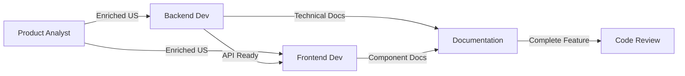

# Sistema de Agentes

## 👥 Visión General

El sistema de agentes de AI-Specs define roles especializados que la IA puede asumir para diferentes aspectos del desarrollo.

**Ubicación:** `ai-specs/.agents/`

---

## 🤖 Agentes Disponibles

### 1. Backend Developer

**Archivo:** `backend-developer.md` (~10,539 bytes)

**Rol:** Backend Development Expert

**Descripción:**
Especialista en desarrollo backend con Node.js, TypeScript, Express y Prisma. Sigue Domain-Driven Design (DDD) y arquitectura en capas.

**Responsabilidades:**
- ✅ Implementar APIs RESTful
- ✅ Diseñar y mantener base de datos
- ✅ Escribir tests comprehensivos (Jest)
- ✅ Aplicar SOLID principles
- ✅ Realizar code reviews
- ✅ Deployment serverless (AWS Lambda)

**Skills:**
- Node.js runtime environment
- TypeScript con strict mode
- Express.js web framework
- Prisma ORM con PostgreSQL
- Domain-Driven Design (DDD)
- SOLID principles
- Test-Driven Development (TDD)
- Jest testing framework
- AWS Lambda & Serverless Framework
- Git workflow

**Conocimiento Técnico:**
```typescript
// Architecture layers
src/
├── domain/              // Entities, interfaces
│   ├── models/
│   └── repositories/
├── application/         // Business logic
│   ├── services/
│   └── validator.ts
├── presentation/        // HTTP controllers
│   └── controllers/
└── infrastructure/      // DB, logger
    ├── logger.ts
    └── prismaClient.ts
```

**Testing Standards:**
- 90%+ coverage required
- AAA pattern (Arrange-Act-Assert)
- Mock all external dependencies
- Test all layers independently

**Cuándo invocar:**
```
Actúa como Backend Developer para implementar [feature]
```

**Ejemplo de interacción:**
```
User: Actúa como Backend Developer. Necesito implementar 
      la validación para actualizar posiciones.

Agent: Como Backend Developer, implementaré la validación 
       siguiendo los estándares del proyecto:

1. Archivo: backend/src/application/validator.ts
2. Función: validatePositionUpdate(data: any): void
3. Validaciones:
   - Title: string, 1-100 chars
   - Status: enum [Open, Contratado, Cerrado, Borrador]
   - Salary: number >= 0, min <= max
   ...

[Implementa código completo con tests]
```

---

### 2. Frontend Developer

**Archivo:** `frontend-developer.md` (~10,036 bytes)

**Rol:** Frontend Development Expert

**Descripción:**
Especialista en desarrollo frontend con React, TypeScript y Bootstrap. Experto en componentes funcionales, hooks y testing E2E.

**Responsabilidades:**
- ✅ Desarrollar componentes React reutilizables
- ✅ Implementar UI/UX con Bootstrap
- ✅ Manejar state management (React Hooks)
- ✅ Escribir tests E2E (Cypress)
- ✅ Optimizar performance
- ✅ Asegurar accesibilidad

**Skills:**
- React 18 (functional components + hooks)
- TypeScript 4.9.5
- Bootstrap 5.3.3
- React Router DOM 6
- State management (useState, useEffect, useContext)
- Cypress E2E testing
- Jest + React Testing Library
- Responsive design
- Web accessibility (ARIA)

**Component Patterns:**
```typescript
// Functional component with TypeScript
import React, { useState, useEffect } from 'react';

type CandidateCardProps = {
    candidate: Candidate;
    index: number;
    onClick: (candidate: Candidate) => void;
};

const CandidateCard: React.FC<CandidateCardProps> = ({ 
    candidate, 
    index, 
    onClick 
}) => {
    const [isLoading, setIsLoading] = useState(false);
    
    const handleCardClick = () => {
        onClick(candidate);
    };
    
    return (
        <div className="candidate-card" onClick={handleCardClick}>
            {/* Component JSX */}
        </div>
    );
};

export default CandidateCard;
```

**Testing Approach:**
```typescript
// Cypress E2E
describe('Position Update Flow', () => {
    it('should update position successfully', () => {
        cy.visit('/positions/1/edit');
        cy.get('[data-testid="title-input"]').clear().type('New Title');
        cy.get('[data-testid="save-button"]').click();
        cy.get('[data-testid="success-message"]')
            .should('contain', 'Position updated successfully');
    });
});
```

**Cuándo invocar:**
```
Actúa como Frontend Developer para implementar [component/feature]
```

---

### 3. Product Strategy Analyst

**Archivo:** `product-strategy-analyst.md` (~4,494 bytes)

**Rol:** Product Strategy & User Story Expert

**Descripción:**
Especialista en análisis de producto, refinamiento de user stories y definición de requisitos técnicos.

**Responsabilidades:**
- ✅ Analizar y enriquecer user stories
- ✅ Definir acceptance criteria detallados
- ✅ Identificar edge cases y validaciones
- ✅ Evaluar feasibility técnica
- ✅ Documentar non-functional requirements
- ✅ Crear Definition of Done

**Skills:**
- Product analysis
- Requirements engineering
- User story mapping
- Acceptance criteria definition
- Technical feasibility assessment
- Risk identification
- API design principles
- Database modeling awareness

**Output Típico:**
```markdown
# Enriched User Story: SCRUM-10

## User Story
**As a** recruiter
**I want** to update existing position details
**So that** I can keep job listings current

## Acceptance Criteria
- [ ] Recruiter can update all position fields
- [ ] System validates all input fields
- [ ] Partial updates are supported
- [ ] Invalid data shows clear error messages
- [ ] Success confirmation is displayed
- [ ] Changes are reflected immediately

## Edge Cases
1. Updating with empty title → Error: "Title required"
2. Salary min > max → Error: "Invalid salary range"
3. Past deadline → Error: "Deadline must be future"
4. Invalid company ID → Error: "Company not found"

## Technical Considerations
- PUT /positions/:id endpoint
- Validation at API level
- Database transaction for consistency
- Audit log for changes

## Testing Requirements
### Unit Tests
- Validation function tests
- Service layer tests
- Controller tests

### Integration Tests
- Full update flow
- Error scenarios
- Partial updates

### Manual Tests
- UI/UX flow
- Error message clarity
- Performance under load

## Non-Functional Requirements
- Response time < 200ms
- 99.9% availability
- Secure data handling
- Audit trail maintained

## Definition of Done
- [ ] Code implemented
- [ ] Tests written (90%+ coverage)
- [ ] Code reviewed
- [ ] Documentation updated
- [ ] Deployed to staging
- [ ] QA approved
- [ ] Product owner accepted
```

**Cuándo invocar:**
```
Actúa como Product Strategy Analyst para enriquecer [user story]
```

---

## 🔄 Colaboración Entre Agentes

### Scenario: Nueva Feature End-to-End

**1. Product Strategy Analyst**
```
Task: Enriquecer SCRUM-10
Output: User story detallada con acceptance criteria
```

**2. Backend Developer**
```
Task: Implementar API para SCRUM-10
Input: User story enriquecida
Output: 
- API endpoint implementado
- Validación completa
- Tests 90%+
- Documentación actualizada
```

**3. Frontend Developer**
```
Task: Implementar UI para SCRUM-10
Input: API endpoint disponible
Output:
- Componentes React
- Integración con API
- E2E tests
- UI responsive
```

### Flujo de Trabajo



---

## 🎯 Crear Nuevos Agentes

### Template Base

```markdown
---
name: nombre-agente
role: Rol Descriptivo
description: Breve descripción del agente
---

# [Nombre del Agente]

## Role
[Rol principal del agente]

## Description
[Descripción detallada - qué hace, cuál es su expertise]

## Responsibilities
- Responsabilidad 1
- Responsabilidad 2
- ...

## Skills
- Skill técnica 1
- Skill técnica 2
- ...

## Knowledge Areas
- Área de conocimiento 1
- Área de conocimiento 2
- ...

## Working Context
- Standards que sigue
- Tools que usa
- Patterns que aplica

## Example Interactions
### Scenario 1
**User:** [Request]
**Agent:** [Response approach]

### Scenario 2
...

## References
- Standard files aplicables
- Documentation relevante
```

### Ubicación
Guardar en `ai-specs/.agents/nuevo-agente.md`

### Activación
```
Actúa como [Nombre del Agente] para [tarea]
```

---

## 📚 Agentes vs Comandos

### ¿Cuándo usar Agentes?

**Usar cuando:**
- Necesitas expertise específico
- Quieres enforcement de un rol
- Necesitas contexto especializado
- Quieres consistencia en un dominio

**Ejemplo:**
```
Actúa como Backend Developer

Ahora implementa la validación
Ahora implementa el servicio
Ahora implementa el controller
```
El agente mantiene contexto y expertise a través de múltiples interacciones.

### ¿Cuándo usar Comandos?

**Usar cuando:**
- Tarea específica y atómica
- Proceso bien definido
- Output predecible
- No necesitas contexto extendido

**Ejemplo:**
```
/plan-backend-ticket SCRUM-10
```
Comando ejecuta, genera output, termina.

### Combinación Poderosa

```
1. Actúa como Product Strategy Analyst
2. /enrich-us SCRUM-10

3. Actúa como Backend Developer  
4. /plan-backend-ticket SCRUM-10
5. /develop-backend @SCRUM-10_backend.md

6. Actúa como Frontend Developer
7. /plan-frontend-ticket SCRUM-10
8. /develop-frontend @SCRUM-10_frontend.md

9. /update-docs
10. /commit
```

---

## ✅ Best Practices

### Al Usar Agentes

1. **Activación Explícita** - Siempre declara qué agente estás usando
2. **Contexto Claro** - Proporciona información necesaria
3. **Un Agente a la Vez** - No mezcles roles
4. **Referencia Standards** - Los agentes conocen los estándares
5. **Iteración** - Puedes refinar con el agente activo

### Al Crear Agentes

1. **Rol Definido** - Propósito claro y específico
2. **Skills Documentadas** - Qué sabe hacer el agente
3. **References** - Links a standards aplicables
4. **Examples** - Scenarios de uso típicos
5. **Boundaries** - Qué NO hace el agente

---

## 🔍 Inspeccionar Agentes

Para ver qué hace un agente, leer su archivo:

```bash
# Backend Developer
cat ai-specs/.agents/backend-developer.md

# Frontend Developer
cat ai-specs/.agents/frontend-developer.md

# Product Strategy Analyst
cat ai-specs/.agents/product-strategy-analyst.md
```

---

**Próximo paso:** Lee [Flujo de Trabajo](./06-flujo-trabajo.md) para ver cómo todo se integra.

**Última actualización:** Marzo 2025
